# **Flag-along**

**Flag-along** is a quiz game designed to let the player test their knowledge about diffrent flags in the world. It is an interactive ultiple-choice quiz that aims to encourage the player to learn as they play, giving the user feedback on the right answer as well as their score along the game. With a ever changing highscore list at the end, the user is encouraged to strive for better results during the next round of play. Three diffrent levels of difficulty makes the quiz suitable for both the novice flag-knower as well as the more well flag-versed player that would like a challenge. Let's see if **you** can make it onto the highscore list!?  

Let me introduce you further to [**Flag-along**](https://monika-81.github.io/project2)!
<br>
<br>

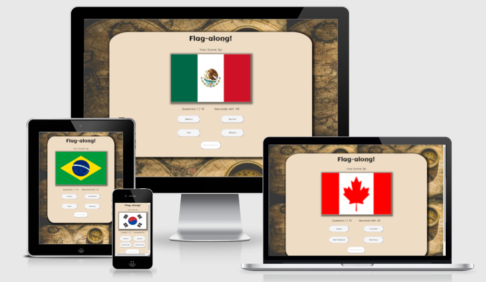
<br>


## **Content**
1. [**Design**](#design)
    - [The layout](#the-layout)

2. [**Features**](#features)
    - [Game logo](#game-logo)
    - [Intro flag](#intro-flag)
    - [Game instructions](#game-instructions)
    - [Quiz area](#quiz-area)
    - [Score count](#score-count)
    - [Quiz flag](#quiz-flag)
    - [Question and time count](#question-and-time-count)
    - [Answer buttons](#answer-buttons)
    - [Next question](#next-question)
    - [Next level](#next-level)
    - [Time out](#time-out)
    - [Game over](#game-over)
    - [Highscore List](#highscore-list)
    - [Future features](#future-features)

3. [**Technologies**](#technologies)

4. [**Testing**](#testing)
    
5. [**Deployment**](#deployment)
    - Forking
    - Deployment

7. [**Credits**](#credits)
    - [Content](#content)
    - [Media](#media)
    - [Acknowledgement](#acknowledgement)

[Back to top](#Flag-along)


---

## **Design**

### **The layout**
The design choice for the Flag-along was to get the user thinking about traveling and knowledge. With a somber background inspired by "the world" and a game area layout of "question cards" to get the feeling of an analog card game. The bright colors of the flags are intended to be the popping color compared to the rest of the somber colors in viewport window. The design was pict to be easily transitioned between diffrent viewports to keep the same feeling of the game no mather of what sort of device the user is playing on.

<br>


<br>
<br>

- **Wireframes**
  Initially the design idea was sketched with pen and paper and thereafter transformed to wireframes with the help of **Balsamiq** for a clearer visual approached of the end result and to start the development layout of the game. The final result was altered slightly; the heading with the game name was moved inside the game area for better visual of the text. And the highscore list was moved from underneath the game area to a modal in the end of the game, since it was easily missed on a smaller viewport that requires scrolling to find the highscore list. Both also because it compromised the game area on smaller screens aswell as was distracting for the user during the game play on desktop. But overall the main design idea was kept throughout the project.

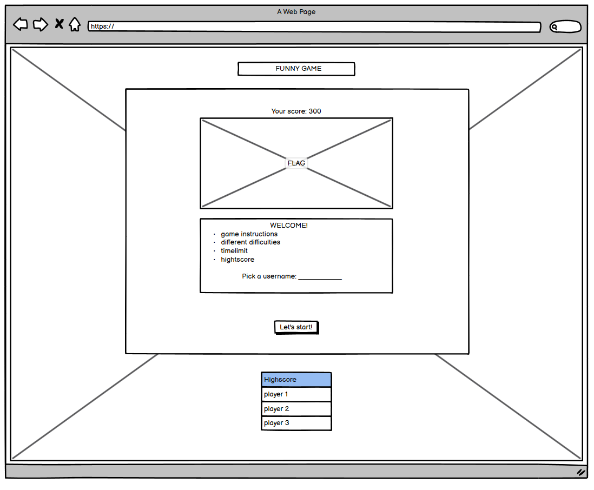 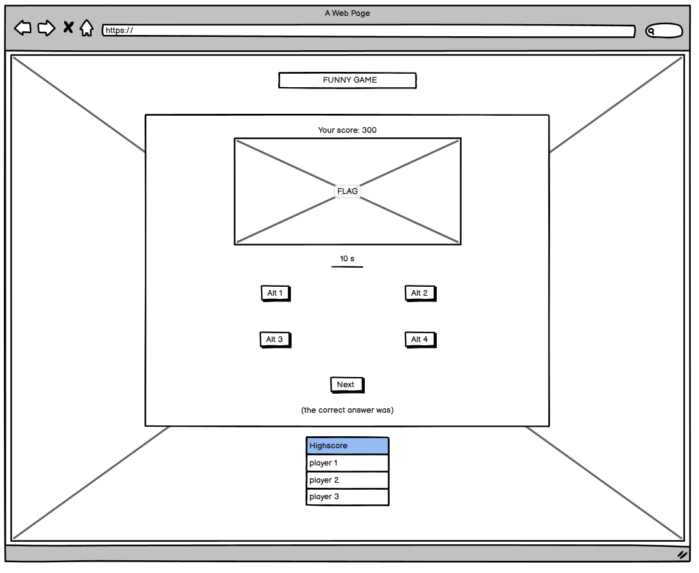 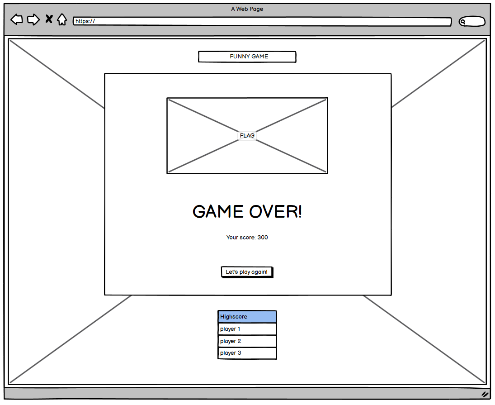 
<br>
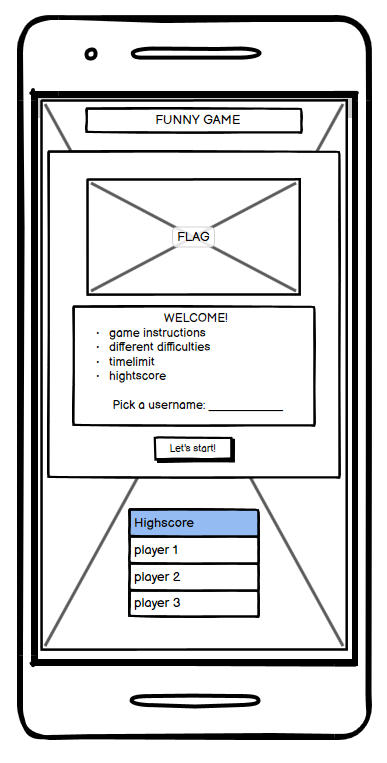 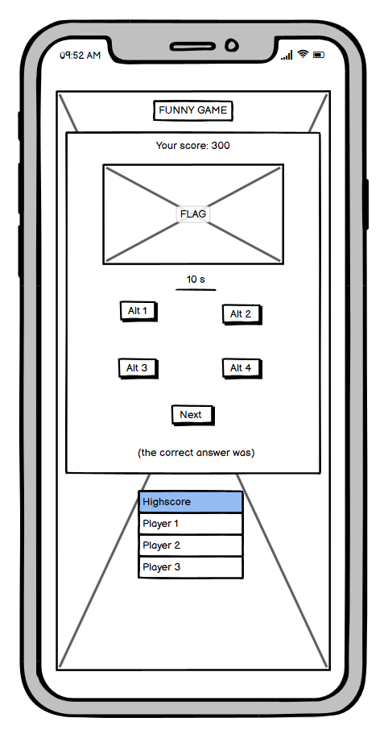 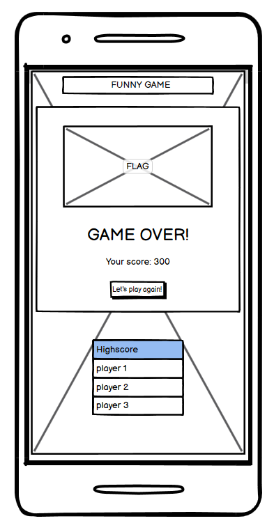 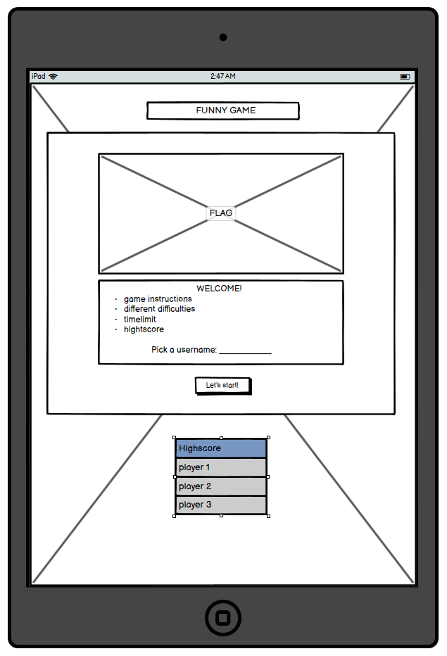 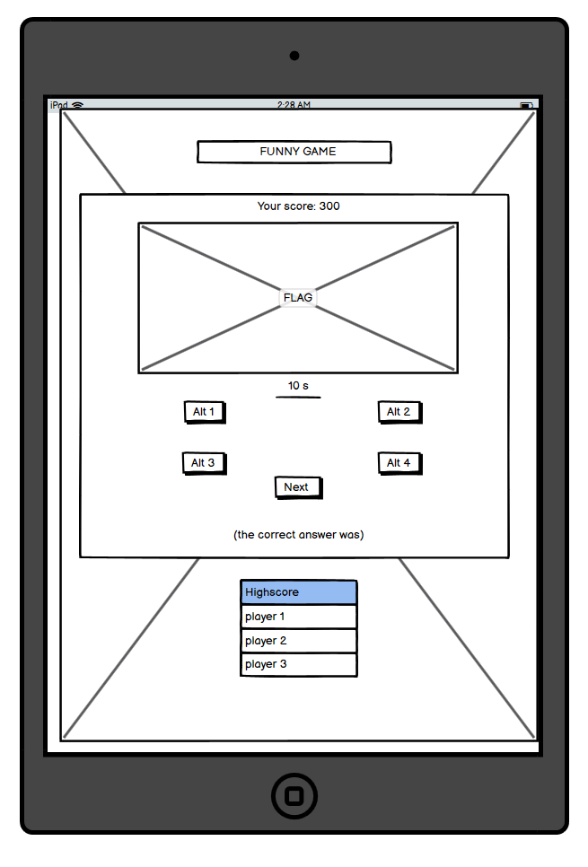 
<br>
<br>

---

## **Features**

### **Game logo**

On top of the game area is the game name, the game logo **Flag-along**. Declaring the name of the game for the user. The logo is also an internal link bringing the user back to the start of the game if clicked. The lgo is of dark color against a light background to make it easy to read.

<br>

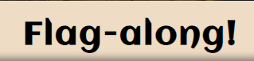
<br>
<br>

### **Intro flag**

Underneath the game logo the user is greated with an Flag of commonwealth of Nations that is inteded as an ""introductory flag" to the game. Letting the user know that the game is about flags both with the game logo and the intro flag. Under the flag is a welcoming greating to start of the introduction of the game to the user.

<br>

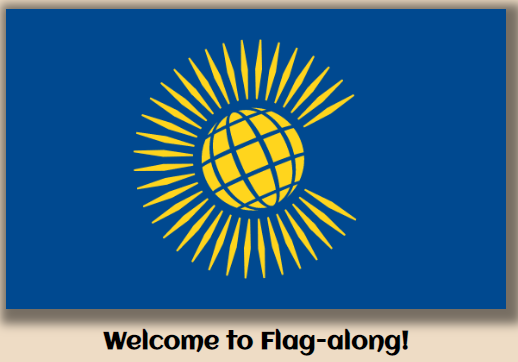
<br>
<br>

### **Game instructions**

The game instructions under the intro flag describes in a few sentences what the game is about and what the user needs to achive to progress in the game:
 - Three levels with 10 questions each and four answer to choose from.
 - A time limit of 60 seconds per level.
 - To look for the green button to know if they'd answered correctly or not. 
 - The score required to go to next level.
 - It also gives the user information that there is a highscore list that they can try to get on to.
<br>

After reading the instructions the user finds a button that will start the game when they are ready.

<br>

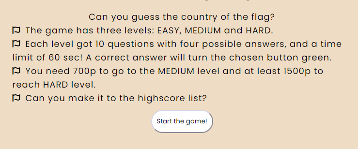
<br>
<br>

### **Quiz area**

After pressing the start button underneath the game instructions the player is transfered to the quiz page. Where the user finds the flag at the top and the aswer buttons there under.

<br>

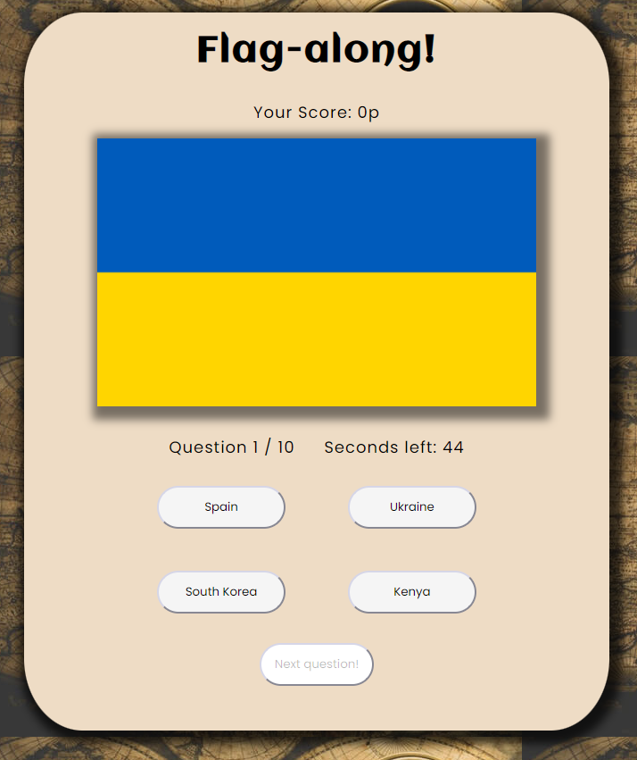
<br>
<br>

### **Score count**

The user will find their score between the logo and the flag they are quessing on. The counting goes up the moment the player guesses on the right flag. Each right answer gives the player a score of 100p but nothing happens if the player gets the answer wrong.

<br>

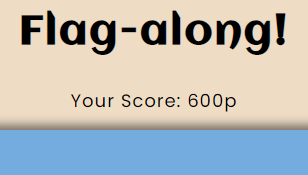
<br>
<br>

### **Quiz flag**

Directly under the logo and the score count is the randomly picked quiz flag. It occupies the same area as the intro flag in the beggining of the game And changes as the user proceeds to the next question.

<br>

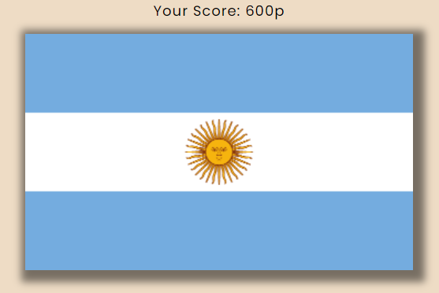
<br>
<br>

### **Question and time count**

There is a question count of the actual question the user is at at the moment, so the user easier knows how far the have come on that particular level. Nest to the question count the user finds the countdown timer, showing how many seconds are left before the level is over and the player needs to restart the game. The question count and timer are displayed side by side for the user to rapidly find the information needed to strategies how much time he or she can think for or if they need to rush their answering.

<br>

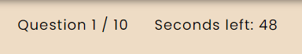
<br>
<br>

### **Answer buttons**

For each flag the user gets four countries to choose from. In the neutral stage the answer buttons are white and slightly shifts in both color and position if hovered over with a mouse.

<br>

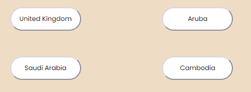 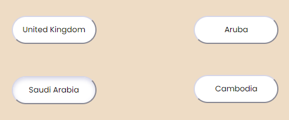
<br>
<br>

When the user has picked wich contry the thinks the flag belongs to, the button picked will change color to display if the answer is correct or not. It turn green if the choice was correct. Else it turns red while the correct button turns green, so the user can learn the correct country. When a button is pressed the user can not change to another answer and the answer buttons are disabled from interaction.

<br>

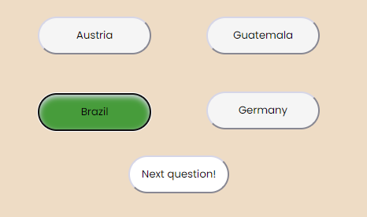 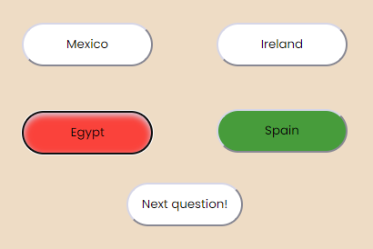
<br>
<br>

### **Next question**

To get to the next question the user actively has to press the "next question"-button. The button is disabled before the user has quessed on the current question to prevent the user from accidentally skipping a question. After the user has made their chose of an answer the next question-button is enabled. The button has the same design and hover effect as the answer buttons if hover by a mouse cursor.

<br>

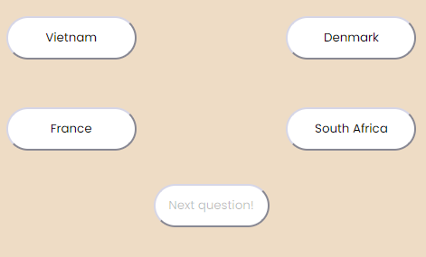 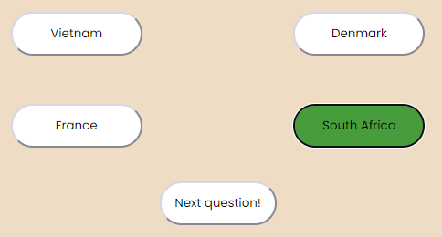
<br>
<br>

### **Next level**

If the user gets 700p or more on the easy level or atleast 1500p after the medium level, they proceed to the next level. After the 10th question the user is introduced to the next level message, encourageing the user to keep on playing but also informing the user that they got the choice to start over again at the beginning of the game if they like. The user kan click a link in the message or proceed by clicking the "go to medium level" or "go to hard level"-buttons.

<br>

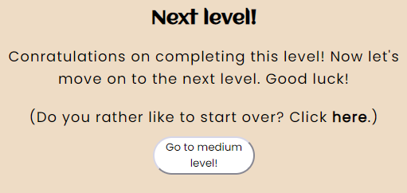 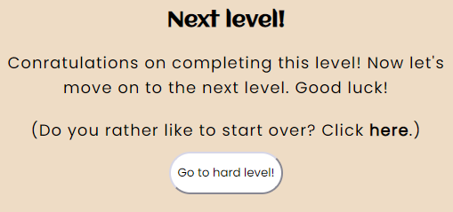
<br>
<br>

### **Time out**

If the user runs out of time an alert will display to tell the user that they timed out. When the user has closed the alert window the game will take the user to the game over page.

<br>

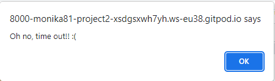 
<br>
<br>

### **Game Over**

If the user dosen't succed to reach the required score, if the time runs out or if the user completes the hard level - they are displayed with the game over-message. The message informs the player that the game now is over and they have a possibility to supply their score to see if the made it to the highscore list or to restart the game and try again.

<br>

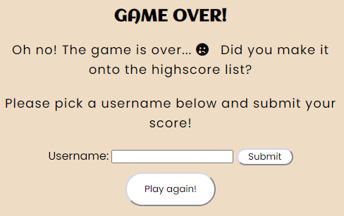 
<br>
<br>

### **Highscore list**

If the user submit their name to the input field above they get to se the highscore list. The list is a modal displayed over the rest of the game and contains the five highest scores of the game.

<br>

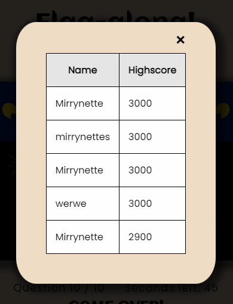
<br>
<br>

### **Future features**
- Highscore list saved on a server for the possibility to see other users score.
- A confetti rain if the user makes it on the highscore list.
- More levels with harder questions.
- The possibility to guess again or after asking for a clue, but with less score points earned.


[Back to top](#Flag-along)

---

## **Technologies**

### **Languages**

- **HTML5**
<br> I used HTML to create the base structure of the project. I started with a basic boilerplate set up and created the first crude structure of the page out of the original design. 

- **CSS3**
<br> The CSS was used to apply the custom styles to the HTML skeleton. In a separate document the creation of the design come forth. 

- **Javascript**
<br> Javascript is the life of the game and makes the game interactive for the user. It's the language used to create the functions that drives the game forward.

### **Tools**

- [Balsamiq](https://balsamiq.com/)
    - I used Balsamiq to make the basic wireframes for this project.

- [BrowserStack](https://browserstack.com)
    - I used BrowserStack to test for browser compatibility.

- [DevTools](https://developer.chrome.com/docs/devtools/)
    -  I used DevTools to test both changes in my code and the responsivity of the site.  

- [Font Awesome](https://fontawesome.com)
    - I used Font Awesome for find the icon used on the site.

- [GitPod](https://www.gitpod.io/)
    - I used GitPod as the code editor for this project.

- [GitHub](https://github.com/)
    - I used GitHub to create a repository for my project and to deploy my site.

- [Google Fonts](https://fonts.google.com/)
    - I used Google Fonts to find the fonts used for the site.

- [JS Hint](https://jshint.com/)
    - I used JS Hint to test and validate my javascript code.  

- [Responsive Design Checker](https://responsivedesignchecker.com)
    - I used Responsive Design Checker to test the responsivity of the site.

- [TinyPNG](https://tinypng.com/).
    - I used TinyPNG to cpompress my .png files.

- [WAVE](https://wave.webaim.org/)
    - I used WAVE to test the accessibility of the site.

- [W3Schools](https://www.w3schools.com/) 
    - I used W3C to test and validate my code throughout the project. 

<br>


[Back to top](#flag-along)

---

## **Testing**

For more information about the testing performed during the development, go to the separate [testing](/TESTING.md) page.
<br>
<br>

[Back to top](#flag-along)

---

## **Deployment**

The project was deployed to **GitHub** from **GitPod**:
- Go to the project's repository page at GitHub.
- Go to *settings* in the upper menu, and then choose *pages* in the left-hand menu.
- Under the Source section, select the *Main branch* from the drop-down menu and click *save*.
- On top of the screen there will be a massage displayed with the live link.
<br>


The live link can be found here: https://monika-81.github.io/project2/
<br>

A copy of this GitHub Repository can be made by either making a copy on your local machine or by forking the GitHub content. By using a copy of the repository changes can be made to the copy without affecting the original code. To make a copy of the repository, follow these steps:

**Copy**
- Locate the repository at **GitHub**.
- At the top of the file's menu, click the green *code* button to the right.
- The first option in the drop-down menu is clone, where you get three choices of how to clone the repository.
- To clone a copy to your GitHub Desktop, click **Open with GitHub Desktop**.
- By clicking "choose" you can pick where you want to store the clone on you local machine.
- And finally, click the button *clone*.
<br>

**Forking**
- Locate the repository at **GitHub**.
- At the top right-hand side is a button called *fork*, click on the button to create a copy of the original repository in your GitHub Account.
<br>
<br>

[Back to top](#flag-along)

---

## **Credits**

### **Content**

I **consulted** following sites for help with code design:
- To learn bore about flexbox I found information att [CSS-tricks](https://css-tricks.com/snippets/css/a-guide-to-flexbox/) and used part of what I learned in the css-code.
- For learning more about stacking my divs with the help of this code from the user [Mario Petrovic](https://stackoverflow.com/users/3955557/mario-petrovic) on [Stack Overflow](https://stackoverflow.com/questions/1909648/stacking-divs-on-top-of-each-other):


```
.container {
  width: 300px;
  height: 300px;
  margin: 0 auto;
  background-color: yellow;
  /* important part */
  display: grid;
  place-items: center;
  grid-template-areas: "inner-div";
}

.inner {
  height: 100px;
  width: 100px;
  /* important part */
  grid-area: inner-div;
}
```
- I learnt more about local storage by reading on this page at [Stack Overflow](https://stackoverflow.com/questions/43762363/how-to-store-an-array-of-objects-in-local-storage) as well as reading on previous treads on the Code Institutes Slack community. No single passage of code was borrow, but built by trail and error.
- I learnt how to shuffle and calculate a new question by looking at this video by [Learn {to} Code](https://www.youtube.com/watch?v=icb9AUBeznQ) on Youtube. Part of the code was borrow from his video and adjusted to suit my project.
- The modal code was largly borrowed and inspired from this site on [W3School](https://www.w3schools.com/howto/howto_css_modals.asp).
- To create the button effects I used code from [Copy & Paste CSS](https://copy-paste-css.com/):
```
:active{
    box-shadow: inset 0px 3px 7px #d6d6e7;
    transform: translateY(2px);
}
```
- The highscore function was coded with help of the LMS form and array lessons as well as some help from this page at [W3School](https://www.w3schools.com/jsref/jsref_sort.asp).
- Adding a timer function with the help of this pages: [Stack overflow](https://stackoverflow.com/questions/44314897/javascript-timer-for-a-quiz/44315106#44315106) - last two code comments partly used after adjustments.
- With the help of this page I figured out how to restart the timer at the start of each game: [Tutorial Link](https://javascript.tutorialink.com/reset-timer-back-to-0-by-using-the-timer-setinterval-clearinterval-for-stopwatch/).

<br>

### **Media**
- The background images comes from the artist Ylanite Koppens at [Pexels.com](https://www.pexels.com/sv-se/@nietjuh).
- The flag icon on the start page are from [Font Awesome](https://fontawesome.com/).
- the flags used in the quiz comes from [Flagpedia](https://flagpedia.ne).
- The image at the top of this page, that shows how the website is presented on different media screens are a screenshot from [Am I responsive?](http://ami.responsivedesign.is/)
- The [Poppins](https://fonts.google.com/specimen/Poppins?query=poppins) and [Aclonica](https://fonts.google.com/specimen/Aclonica) fonts come from [Google Fonts](https://fonts.google.com/).

<br>

### **Acknowledgement**

- **Nicklas Elling** at Dataföreningen Stockholm for introducing me to Code Institute.
- My mentor **Precious Ijege** at Code Institute for valuable input and encouragement.
- The Slack community for be such an open, warm and sharing place. 
- My friend and senior developer **Alfred Skedebäck** for being a good listener and motivator when I encountered hardship and unscarted territory. Giving small tips anf pointing me in what direction I should seek the information I needed. Giving hints about what to think about for the future as I become a developer myself. 
- **Viet Hoang** for letting me run the page by him and for getting user experience input before, during and at the final stage of the project.
- My friends that tested the game on diffrent devices, and diffrent level of flag knowledge that provided me with good user input.


[Back to top](#flag-along)

---


