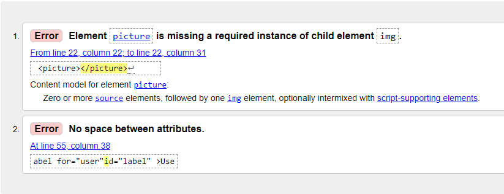
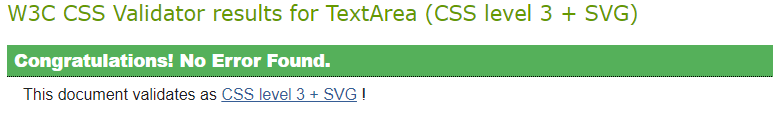
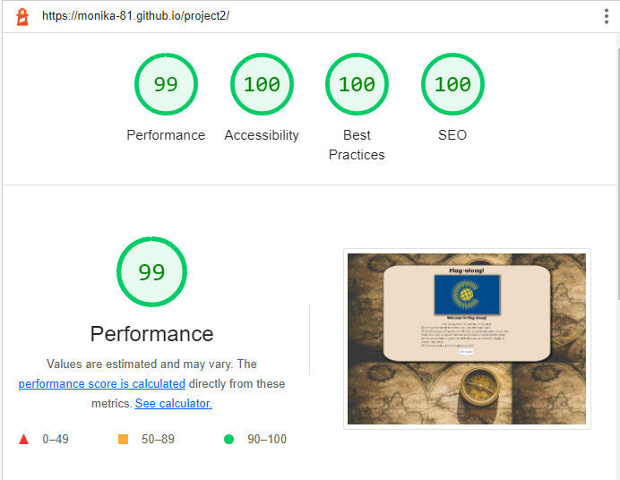
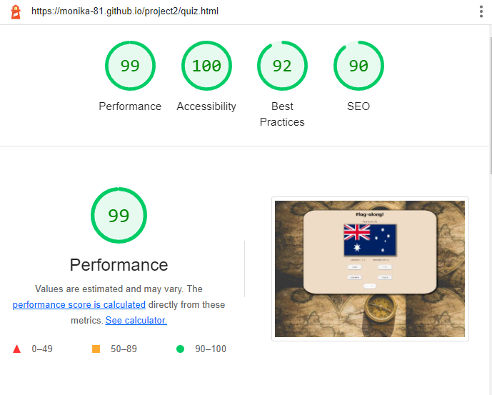
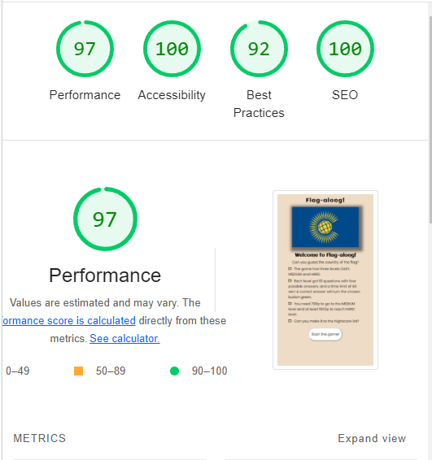
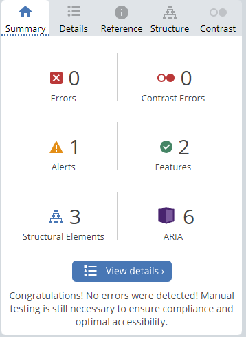
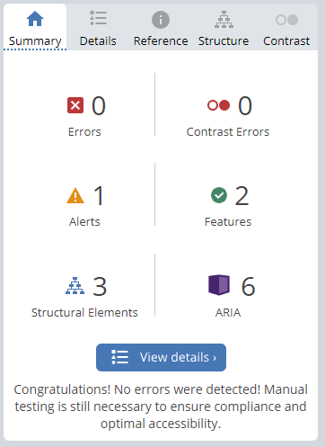

# **Testing**

1. [Manual testing](#manual-testing)
    - Responsive Design Checker
    - DevTools
    - Am I responsive?
    - BrowserStack
2. [Code validation](#code-validation)
    - W3Schools
        - HTML
        - CSS
        - JS Hint
    - Lighthouse
    - WAVE
3. [Bugs and fixes](#bugs-and-fixes)

---

### **Manual testing**

During the entire developing stage I repeatedly tested the elements added and altered regarding appearance as well as responsiveness via the simulated live server GitPod provides. After the site was live deployed I also checked the site regularly trough my smartphone for first hand updates on a live mobile viewport. My friends that tested the game on diffrent mobiles and desktop viewport also rapported that they found the game working well.

 

- [Responsive Design Checker](https://responsivedesignchecker.com)
- [DevTools](https://developer.chrome.com/docs/devtools/)

In combination with the direct visual view of the page provided by the live server I frequently used Google Chrome developer tools, both for direct changes of the code as well as the tools for responsive testing of different platforms and screen sizes. As a compliment to DevTools I also checked how the website responded on diffrent screen sizes and screen orientaion using Responsive Design Checker. The final version of website passed all the visual and functional apperences changes on both large and small screens.

 

- [Am I responsive?](http://ami.responsivedesign.is/)

To get a second opinion of how the site worked in regard to different screen sizes, I checked the result at "Am I Responsive?" The result is shown as a screenshot at the [introduction](./README.md) of the project.

 

- [Browserstack](https://browserstack.com)

The websites compatability to various browsers (Chrome, Safari, Opera, Firefox, Internet Explorer, Edge) including diffrent versions of said browsers, was tested using the BrowserStack application on both desktop and mobile. Diffrent mobile versions was tested also for diffrent browsers. Over all the appearance, functionality and responsiveness were consistent throughout for most of the devices and browsers. No notable diffrence in apperence was found.

 

[Back to top](#testing)

---

### **Code validation**
 

- [HTML and CSS Validation](https://www.w3schools.com/) 

When the basic structure of the project was done I ran code validation through W3Schools Validator for all the HTML files as well as the CSS file. This procedure was repeated multiple times to validate that the code was working during the developing process. Nothing was found during CSS testing but a few small error occured during HTML testing. One aspect was not fixed (see screenshot below) since the picture element in the HTML file is a script-supporting element for the quiz flags in the javascript files.
 

- [Lighthouse](https://developers.google.com/web/tools/lighthouse)

I also ran the page through Lighthouse for both desktop and mobile to test out the performance and accessibility of the page. The input gave me further information how to proceed with the project; for exampel to minimize image files and minify javascript. I didn't do it as extensive as lighthouse suggested though since I was not sure how the WEBP file would work instead of the PNG file. Instead I compressed the PNG files (see **Content** section on previous page). I tried the minimizing tool for javascript that Lighthouse suggested but didn't accept the much compressed script it suggested. Instead I minimazed the white spaces in the question.js file as much as I could while still leaving the script readable. The process with Lighthouse was repeated after all major changes and bug fixes. The final result is shown below:
 

- [JS Hint](https://jshint.com/)

The same procedur as the code validation above went into the validation of the javascript code. With the help of JS Hint i validated my code. First output reported on missing semicolons but nothing else. The final result is shown below.
 
 

**W3School**

HTML 
There was a small problem in the index file that was easily

 

 

CSS
 

 
 

**Lighthouse** 

   
 
Desktop: Start page, quiz page and SEO comment for quiz page (not adjusted since the link is inside the site logo).  
(The best practice had input about the image size not being scaled down correctly, an issue mot changed since the diffrent flag files have diffrent sizes and I ewanted the same size on all the flags displayed in the quiz.)
 
 

  
 
(The mobile performance was sometimes lower but lighthouse then calculated on the medium image that isn't in use on mobile or tablet viewports due to media queries. The inspect element section of DevTools shows the correct smaller size being used but the lighthouse test runs the medium size picture anyway. eEst practice score is lower of the same reason as for the desktop: wrong image ratio.)
 
 

**JS Hint**

 

 
 

- [WAVE](https://wave.webaim.org/)

To validate the accessibility further I also tested the site at Wave - Web Accessibility Evaluation Tool. No errors where found.

  
 
 

[Back to top](#testing)

---

### **Bugs and fixes**
There where a number of bugs and mishaps committed through the development. Most of the trial and error was fixed with commenting out and console.loging at various places to find where the bug was.  

**The major bugs where**:  
1. Repeatedly the eventlistener did not work. 
    - Fixed by changing from class name tergeting to id for more specific targeting.
2. From the start I though I had to separate into three separate files for html and script. 
    - During the development process I saw that it was unnecesseary and made the coding harder, so I changed back to fewer files.
3. The username input filed lacked validation and blank results could be submited.
    - Fixed in the function the submit-button starts: (user.value === "") {return false;}
4. The user could also repeat the same submit of username multible times.
    - Fixed by the same function: disabeling the button after a valid submit.
5. The countdown-timer did not go back to zero when the user restarted the game. Kept counting score from the last score value in previous game.
    - Fixed by adding: 'score.innerText = 0;' and 'currentScore = null;' to the start of each game.
6. The stacked nextquestion buttons for the medium and hard level did not disapear after restarting game if the user reached those levels. Resulting in the hard next question button to turn to the game over screen after 10 questions even if the user just restarted at easy level.
    - Noticed I didn't hide the buttons again at restart. Hade two diffrent types of code with the same purpose to hide elements 'style.display' and 'classlist.add/remove'. Adjusted code to be consequent and added 'mediumNextBtn.classList.add('stack');' and 'hardNextBtn.classList.add('stack');' to game over-function.
7. Countdown timer didn't restart counting at the start of a new game after game over or if the user choose to play a level again. Was locked at the last value of seconds left after last game.
    - Added restart timer function to the start of each game. (Code credit, see **Credits** on previos page.)
8. The next button was showing for the first quesion at every restart, makeing it possble to skip the first qustion without answering.
    - Added 'nextBtn.disabled = true;' at the start of each game.       

 

For most of the bug fixes I went back to the [Code Institute](https://codeinstitute.net/) LMS and the learning material for the Javascript module and found the answers there. I also turned to the Slack community and the search function, where I found many answers. In addition to that I also consulted external sources while searching for the answer using [Google](www.google.com). For more information about the external code used, see the section on the previous page.

 

**Bug not fixed**:
- None

[Back to top](#testing)

---